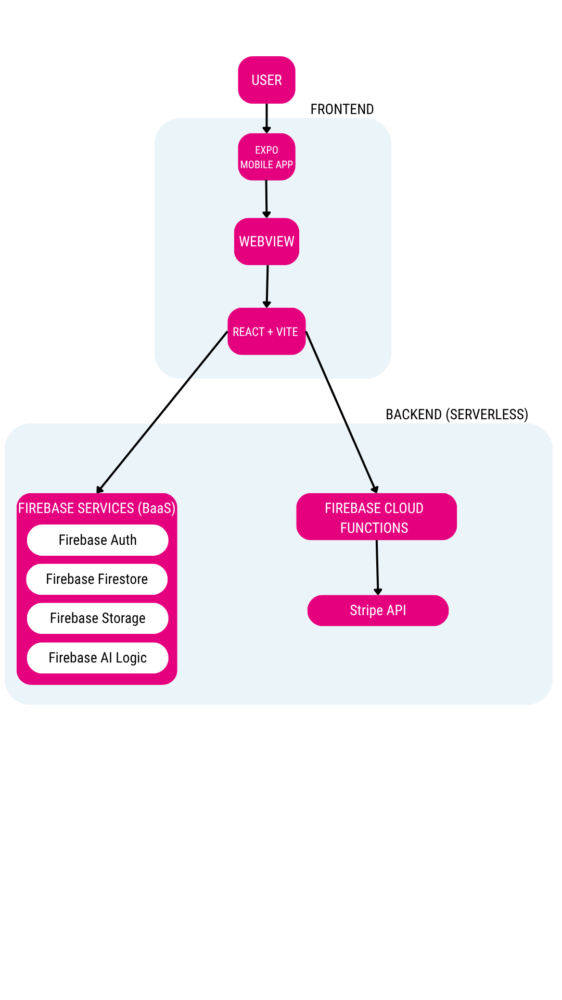

# MindMend
 
MindMend je mobilna aplikacija za duševno zdravje in dobro počutje. Združuje spremljanje razpoloženja, AI analizo, sprostitvene vsebine ter komunikacijo s terapevti v eno interaktivno platformo.
 
🌐 **Delujoča rešitev:** [https://mindmend-a8839.web.app](https://mindmend-a8839.web.app)

📱 **Android APK** — namesti aplikacijo s QR kodo:


 
---

## Opis projekta
Projekt je izdelan kot kombinacija:
- React Native + Expo mobilne aplikacije
- React + Vite spletnega vmesnika (Figma Make template)
Trenutno aplikacija deluje tako, da se originalni Figma Make frontend zažene kot spletna aplikacija (Vite development server), nato pa se preko `react-native-webview` prikaže znotraj Expo mobilne aplikacije.
To omogoča:
- identičen izgled kot v Figma Make templatu
- identične animacije
- identičen flow med stranmi
- hitrejši razvoj UI-ja
- ohranitev vseh funkcionalnosti iz templata
Mobilna aplikacija je zato trenutno tehnično:
- native Expo aplikacija
- ki znotraj sebe prikazuje React/Vite frontend preko WebView komponente

---

## Uporabniki sistema
 
| Vloga | Opis |
|---|---|
| **Uporabnik** | Sledi razpoloženju, bere vsebine, rezervira termine, komunicira s terapevtom |
| **Terapevt** | Sprejema termine, pregleduje napredek klientov, upravlja profil |
 
---

## Glavne funkcionalnosti
 
- 📊 Dnevno sledenje razpoloženja in počutja
- 🤖 AI analiza razpoloženja (Gemini)
- 📚 Knjižnica sprostitvenih vsebin
- 📅 Rezervacija in upravljanje terminov
- 💬 Komunikacija med klientom in terapevtom
- 🔔 Push obvestila za opomnike in termine
- 💳 Plačevanje terminov (Stripe)

---

## Arhitektura sistema
 

 
---

## Posnetki zaslona
 
<p float="left">
  
  
  
  
</p>

---

## Namestitev
 
### Zahteve
- Node.js 18+
- npm
- Firebase CLI (`npm install -g firebase-tools`)
- Expo Go (za testiranje na mobilni napravi)

### 1. Kloniranje projekta
```bash
git clone https://github.com/anacvetkoo/mind-mend.git
cd mind-mend
```

### 2. Namestitev odvisnosti
```bash
# Root (Expo)
npm install
npm install react-native-webview
npx expo install expo-auth-session expo-web-browser
 
# Web frontend
cd web-template
npm install        # če napaka: npm install --legacy-peer-deps
cd ..
 
# Cloud Functions
cd functions && npm install && cd ..
```

### 3. Nastavitev spremenljivk okolja
```bash
cp .env.example .env
cp web-template/.env.example web-template/.env
cp functions/.env.example functions/.env
```
Odpri vsako `.env` datoteko in vpiši vrednosti (Firebase ključi, Stripe ključi itd.).
> ⚠️ `.env` datoteke so v `.gitignore` in se ne commitajo v repozitorij.

### 4. Prijava v Firebase
```bash
firebase login
```

### 5. Gemini API Key
1. Pojdi na [https://aistudio.google.com](https://aistudio.google.com)
2. Prijavi se z Google računom
3. Dashboard → API Keys → Create API Key → izberi projekt MindMend
4. Kopiraj ključ in ga vpiši v `.env`: `EXPO_PUBLIC_GEMINI_API_KEY=tvoj_ključ`

---

## Zagon
Projekt potrebuje **tri terminale**.

### Terminal 1 — Firebase Functions emulator 
```bash
firebase emulators:start
```
 
### Terminal 2 — Web frontend
```bash
cd web-template
npm run dev -- --host 0.0.0.0
```
 
Po zagonu kopiraj `Network` URL (npr. `http://192.168.x.x:5173`) in ga nastavi v root `.env`:
 
```
EXPO_PUBLIC_WEB_APP_URL=http://192.168.x.x:5173
```
 
### Terminal 3 — Expo mobilna aplikacija
```bash
npx expo start -c
```

Skeniraj QR kodo z aplikacijo **Expo Go** na mobilni napravi.


---
 
## Tehnologije
 
- **Frontend:** React, TypeScript, Vite, TailwindCSS
- **Mobile:** React Native, Expo, WebView
- **Backend:** Firebase Auth, Firestore, Firebase Storage, Cloud Functions
- **AI:** Google Gemini API
- **Plačila:** Stripe
